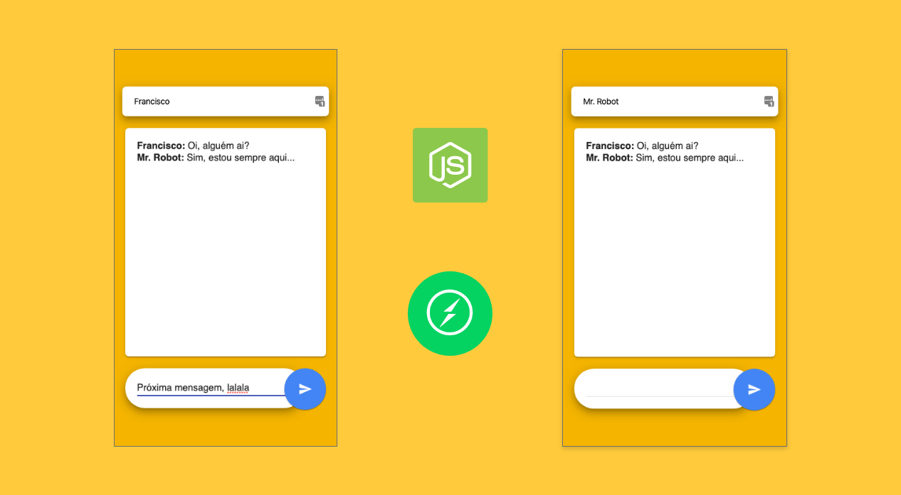

# Express Chat

  

  
  
  

  

  

Este repositório contém um chat inteiramente feito com Express, NodeJs e Socket.IO.

Tecnologias:

- [NodeJS](https://nodejs.org/en/)
- [ExpressJS](https://expressjs.com/)
- [Yarn](https://yarnpkg.com/)

## Como executar

Faça o clone/download deste repositório, execute `yarn`. Logo em seguida você pode executar o chat como desenvolvedor através comando `yarn start` tendo acesso aos logs. O chat fica localizado em `http://localhost:3000`.

## Rotas

Este projeto contém as seguintes rotas:

- `GET /` : renderização do .html
